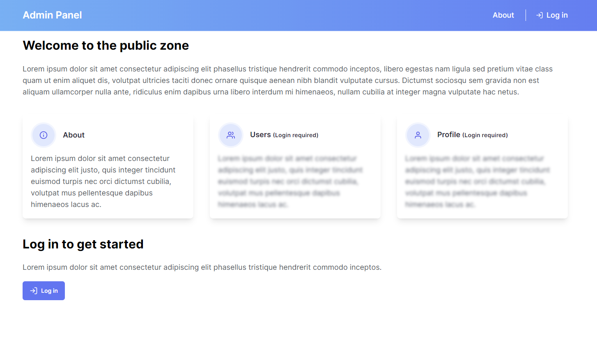

# Panel de administración
Este repositorio contiene el código fuente para un panel de administración desarrollado con React, Next.js, Vercel, Tailwind CSS, TypeScript, Auth0 y componentes de UI como Preline y React Icons. El panel de administración utiliza las siguientes APIs: jsonplaceholder y dicebear (biblioteca de avatares) para servir datos de usuarios que solo son visibles para usuarios autenticados.

Este ejemplo muestra cómo puedes usar `@auth0/nextjs-auth` para agregar fácilmente soporte de autenticación a tu aplicación Next.js aplicando los siguientes flujos de autenticación:

- Iniciar sesión
- Cerrar sesión
- Cargar el usuario en el lado del cliente y usar páginas SSR rápidas/caché (pages/index.tsx)
- Cargar el usuario en el lado del cliente y verificar la autenticación en páginas CSR (pages/profile.tsx)
- Crea controladores de ruta internos que realizan diferentes partes del flujo de autenticación (pages/auth/[...auth0].tsx)

## Captura de pantalla


## Requisitos previos
Antes de ejecutar la aplicación en tu sistema local, asegúrate de tener instalados los siguientes requisitos:

- Node.js (versión 12 o superior) | [nodejs.org](https://nodejs.org/es/download/)
- npm (administrador de paquetes de Node.js) | [npmjs.com](https://www.npmjs.com/get-npm)
- Auth0 | [auth0.com](https://auth0.com/signup)
- Vercel | [vercel.com](https://vercel.com/signup) (opcional)

## Instalación
Sigue los siguientes pasos para instalar y ejecutar la aplicación:

1. Clona este repositorio en tu máquina local:

```bash
git clone https://github.com/tu-usuario/admin-panel.git
```
2. Navega al directorio del repositorio clonado:

```bash
cd admin-panel
```

3. Instala las dependencias del proyecto:

```bash
npm install
```

## Configuración de Auth0
1. Accede al panel de control de Auth0 y crea una nueva aplicación de tipo _Single Page Application_  asegurándote de configurar lo siguiente:
2. Ve a la página de configuración de la aplicación.
3. Configura los siguientes ajustes:
    - Allowed Callback URLs: Debe establecerse como http://localhost:3000/api/auth/callback cuando pruebes localmente o típicamente como https://myapp.com/api/auth/callback al implementar tu aplicación.
   - Allowed Logout URLs: Debe establecerse como http://localhost:3000/ cuando pruebes localmente o típicamente como https://myapp.com/ al implementar tu aplicación.
4. Guarda los ajustes.

### Configuración de variables de entorno
1. Para conectar la aplicación con Auth0, necesitarás agregar los ajustes de tu aplicación de Auth0 como variables de entorno.

2. Copia el archivo .env.local.example de este directorio a .env.local (que será ignorado por Git):

```bash
cp .env.local.example .env.local
```

3. Luego, abre .env.local y agrega las variables de entorno faltantes::

```bash
NEXT_PUBLIC_API_URL=https://api.example.com
NEXT_PUBLIC_AUTH0_CLIENT_ID=your-auth0-client-id
NEXT_PUBLIC_AUTH0_DOMAIN=your-auth0-domain
AUTH0_ISSUER_BASE_URL=your-auth0-issuer-base-url
AUTH0_CLIENT_SECRET=your-auth0-client-secret
AUTH0_BASE_URL=your-auth0-base-url
AUTH0_SECRET=your-auth0-secret
```

## Ejecución en local
Una vez que hayas completado la instalación y configuración, puedes ejecutar la aplicación localmente con el siguiente comando:

```bash
npm run dev
```

Esto iniciará el servidor de desarrollo y podrás acceder a la aplicación en tu navegador en http://localhost:3000.

## Deploy en Vercel

Puedes inplementar esta aplicación en la nube con [Vercel](https://vercel.com) siguiendo la documentación de Auth0 [aquí](https://developer.auth0.com/resources/guides/web-app/nextjs/vercel-deployment). Que contempla todos los pasos necesarios para configurar tu aplicación en Vercel y Auth0.

## Enlaces a recursos y documentación
Aquí hay algunos enlaces útiles para obtener más información sobre las tecnologías utilizadas en este proyecto:

- Documentación de React [aquí](https://es.reactjs.org/)
- Documentación de Next.js [aquí](https://nextjs.org/docs)
- Documentación de Vercel [aquí](https://vercel.com/docs)
- Documentación de Tailwind CSS [aquí](https://tailwindcss.com/docs)
- Documentación de Auth0 [aquí](https://auth0.com/docs)
- Documentación de Preline [aquí](https://preline.co/docs)
- Documentación de React Icons [aquí](https://react-icons.github.io/react-icons/)

## Contribuciones
Si deseas contribuir a este proyecto, puedes hacerlo siguiendo estos pasos:

1. Haz un fork del proyecto.
2. Crea una nueva rama (`git checkout -b feature/feature-name`).
3. Haz commit de tus cambios (`git commit -m 'Add some feature'`).
4. Haz push de la rama (`git push origin feature/feature-name`).
5. Abre un pull request.
6. Espera a que tu pull request sea revisado y aceptado.
7. ¡Comienza a contribuir!

## Autor
- Mariano Álvarez
- [LinkedIn](https://www.linkedin.com/in/ma-marianoalvarez/)
- [GitHub](https://www.github.com/creativoma/)
- [Portfolio](https://dev.creativoma.com/)

## Licencia
Este proyecto está bajo la Licencia MIT. Consulta el siguiente archivo para obtener más detalles: [LICENCIA](./LICENCE)